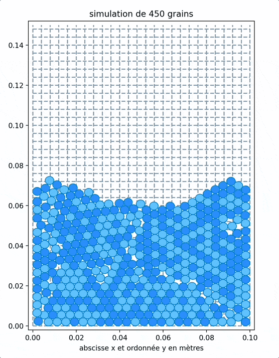

# Fluidization of Granular Media

**TIPE 2025 Project by Even Baudet and Valentine Labous**

This repository contains the experimental and numerical study of **fluidization in granular media**, focusing on validating Darcy and Ergun laws and developing a discrete element model (DEM) to simulate fluidization thresholds.

**Video of the Interface:**

---

## Project Overview
- **Goal**: Observe fluidization phenomena, validate fluidization laws, and develop a numerical model.
- **Methods**:
  - Experimental: Pressure drop measurements, fluidization velocity tests.
  - Numerical: DEM with Verlet integration, collision detection, and Ergun law for fluid-particle interactions.
- **Materials**: Chia seeds, salt, quinoa, sand, lentils.

---

## Repository Structure
   Folder          | Description                                  |
 |-----------------|----------------------------------------------|
 | `/docs`         | Report (**in english and french**), Presentation (**in french**)     |
 | `/src`          | Python scripts for modeling/analysis (**comments in french**)         |
 | `/data`         | Experimental data                             |

---
## Key Results
- **Experimental fluidization velocity**
- **Numerical model**: Validated against experimental data for multiple granular media.
- **Limitations**: Non-spherical particles and size distributions not yet modeled.

---
## How to Use
1. **View the report (in English)**:
   - (docs/granular_fluidisation_report_eng.pdf)
2. **Run the model**:
   - See `/src/DEM_fluidisation.py` (requires Python 3.8+ and `numpy`, `matplotlib`).
3. **View experiments**:
   - Experimental data in `/data`.

---
## Main References
- **[1]**: Julien BAGLIO, Rapport de TP Lit Fluidisé, février 2007..
- **[2]**: Bruno ANDREOTTI, Yoël FORTERRE, Olivier POULIQUEN: Les milieux granulaires - Entre fluide et solide, Février 2011, pages 303-329
- **[3]**: Khalil SHAKOURZADEH, Article issu de Techniques de l'ingénieur: Techniques de Fluidisation, Mars 2002 
- **[4]**: Gérard ANTONINI, Article issu de Techniques de l'ingénieur: Lits fluidisés - Caractéristiques générales et applications, Octobre 2007
- **[5]**: Chaim GUTFINGER, Nesim ABUAF, Advances in Heat Transfer Vol.10: Heat Transfer in Fluidised Beds, 1974, pages 167-174 
